# Подробная цепочка связей функций и методов в проекте LaSTy Language Smart Trainer

## Архитектура проекта

Проект построен на модульной архитектуре с четким разделением ответственности:

### Основные компоненты:
1. **app.py** - Главный интерфейс Streamlit
2. **ai_service.py** - AI сервис для генерации контента и анализа
3. **database.py** - Управление базой данных
4. **training_engine.py** - Движок тренировок
5. **translations.py** - Мультиязычная поддержка
6. **config.py** - Конфигурация

## Диаграмма вызовов функций

```mermaid
graph TD
    A[run.py] --> B[app.py:main]
    
    B --> C[get_services]
    C --> D[DatabaseManager]
    C --> E[AIService]
    C --> F[TrainingEngine]
    
    B --> G[login_page]
    B --> H[dashboard]
    
    G --> I[db.authenticate_user]
    G --> J[db.create_user]
    
    H --> K[dashboard_content]
    H --> L[words_management]
    H --> M[training_session]
    H --> N[statistics_page]
    H --> O[settings_page]
    
    K --> P[db.get_user_statistics]
    
    L --> Q[ai.auto_detect_column_languages]
    L --> R[db.import_word_pairs]
    L --> S[db.get_user_words]
    
    M --> T[training_engine.start_training_session]
    M --> U[training_engine.submit_answer]
    M --> V[training_engine.get_next_task]
    
    N --> W[db.get_user_statistics]
    N --> X[db.get_user_errors]
    
    O --> Y[db.update_user_languages]
    O --> Z[db.update_user_topics]
    O --> AA[db.update_user_interface_language]
    
    T --> BB[db.get_words_for_training]
    T --> CC[_create_task_for_word]
    
    CC --> DD[ai.get_task_type_for_word]
    CC --> EE[_create_translation_task]
    CC --> FF[_create_multiple_choice_task]
    CC --> GG[_create_fill_blank_task]
    
    EE --> HH[ai.generate_sentence]
    EE --> II[ai.translate_sentence]
    
    FF --> JJ[ai.generate_sentence]
    FF --> KK[ai.generate_multiple_choice_options]
    
    GG --> LL[ai.generate_sentence]
    GG --> MM[ai.translate_sentence]
    
    U --> NN[ai.analyze_translation_sentence]
    U --> OO[ai.analyze_target_word_usage]
    U --> PP[ai.classify_translation_errors]
    U --> QQ[ai.analyze_fill_blank_answer]
    U --> RR[ai.analyze_answer]
    U --> SS[db.update_word_progress]
    U --> TT[db.log_error]
    U --> UU[db.log_translation_errors]
    
    V --> VV[_get_session_state]
    V --> WW[_create_task_for_word]
    V --> XX[prepare_next_task_in_background]
    
    XX --> YY[_create_next_task_in_background]
```



## Подробная цепочка вызовов по файлам

### 1. run.py (Точка входа)
```python
run.py:main() 
    └── app.py:main()
```

### 2. app.py (Главный интерфейс)

#### Инициализация сервисов:
```python
get_services()
    ├── DatabaseManager() → database.py
    ├── AIService() → ai_service.py  
    └── TrainingEngine(db, ai) → training_engine.py
```

#### Основные страницы:
```python
main()
    ├── login_page() (если не авторизован)
    │   ├── db.authenticate_user()
    │   └── db.create_user()
    └── dashboard() (если авторизован)
        ├── dashboard_content()
        │   └── db.get_user_statistics()
        ├── words_management()
        │   ├── ai.auto_detect_column_languages()
        │   ├── db.import_word_pairs()
        │   └── db.get_user_words()
        ├── training_session()
        │   ├── training_engine.start_training_session()
        │   ├── training_engine.submit_answer()
        │   └── training_engine.get_next_task()
        ├── statistics_page()
        │   ├── db.get_user_statistics()
        │   └── db.get_user_errors()
        └── settings_page()
            ├── db.update_user_languages()
            ├── db.update_user_topics()
            └── db.update_user_interface_language()
```

### 3. ai_service.py (AI сервис)

#### Генерация контента:
```python
generate_sentence()
    └── llm.invoke() → OpenAI API

translate_sentence()
    └── llm.invoke() → OpenAI API

generate_multiple_choice_options()
    └── llm.invoke() → OpenAI API
```

#### Анализ ответов:
```python
analyze_answer()
    ├── _analyze_sentence_similarity()
    │   └── llm.invoke() → OpenAI API
    └── classify_error()

analyze_translation_sentence()
    └── llm_advanced.invoke() → OpenAI API

analyze_target_word_usage()
    └── llm_advanced.invoke() → OpenAI API

classify_translation_errors()
    ├── analyze_translation_sentence()
    └── analyze_target_word_usage()

analyze_fill_blank_answer()
    └── llm.invoke() → OpenAI API
```

#### Определение языков:
```python
auto_detect_column_languages()
    ├── clean_word_list()
    ├── detect_language() → llm.invoke()
    └── clean_word()
```

### 4. database.py (База данных)

#### Управление пользователями:
```python
create_user()
    └── supabase.table("users").insert()

authenticate_user()
    └── supabase.table("users").select()

get_user_by_id()
    └── supabase.table("users").select()

update_user_languages()
    └── supabase.table("users").update()

update_user_topics()
    └── supabase.table("users").update()

update_user_interface_language()
    └── supabase.table("users").update()
```

#### Управление словами:
```python
import_word_pairs()
    └── supabase.table("word_pairs").insert()

get_user_words()
    └── supabase.table("word_pairs").select()

get_words_for_training()
    ├── supabase.table("word_pairs").select() (overdue words)
    └── supabase.table("word_pairs").select() (other words)

update_word_progress()
    └── supabase.table("word_pairs").update()
```

#### Статистика и ошибки:
```python
get_user_statistics()
    └── supabase.table("word_pairs").select()

log_error()
    ├── supabase.table("errors").select() (check existing)
    └── supabase.table("errors").insert() or update()

log_translation_errors()
    └── supabase.table("errors").insert()

get_user_errors()
    └── supabase.table("errors").select()
```

### 5. training_engine.py (Движок тренировок)

#### Управление сессиями:
```python
start_training_session()
    ├── db.get_words_for_training()
    ├── _create_task_for_word()
    └── _save_session_state()

get_next_task()
    ├── _get_session_state()
    ├── _create_task_for_word()
    └── _create_next_task_in_background()

prepare_next_task_in_background()
    └── _create_next_task_in_background()
```

#### Создание заданий:
```python
_create_task_for_word()
    ├── ai.get_task_type_for_word()
    ├── _create_translation_task()
    ├── _create_multiple_choice_task()
    └── _create_fill_blank_task()

_create_translation_task()
    ├── ai.generate_sentence()
    └── ai.translate_sentence()

_create_multiple_choice_task()
    ├── ai.generate_sentence()
    └── ai.generate_multiple_choice_options()

_create_fill_blank_task()
    ├── ai.generate_sentence()
    └── ai.translate_sentence()
```

#### Обработка ответов:
```python
submit_answer()
    ├── db.get_user_words()
    ├── db.get_user_by_id()
    ├── ai.analyze_translation_sentence() (для translation)
    ├── ai.analyze_target_word_usage() (для translation)
    ├── ai.classify_translation_errors() (для translation)
    ├── ai.analyze_fill_blank_answer() (для fill_blank)
    ├── ai.analyze_answer() (для других типов)
    ├── db.update_word_progress()
    ├── db.log_error()
    └── db.log_translation_errors()
```

### 6. translations.py (Переводы)

#### Основные функции:
```python
get_translation()
    └── Возвращает перевод по индексу языка

get_user_language_index()
    └── LANGUAGE_INDICES.get()
```

## Ключевые потоки данных

### 1. Поток авторизации:
```
run.py → app.py:main() → login_page() → db.authenticate_user() → dashboard()
```

### 2. Поток импорта слов:
```
words_management() → ai.auto_detect_column_languages() → db.import_word_pairs()
```

### 3. Поток тренировки:
```
training_session() → training_engine.start_training_session() → 
_create_task_for_word() → ai.generate_sentence() → 
training_engine.submit_answer() → ai.analyze_*() → db.update_word_progress()
```

### 4. Поток статистики:
```
statistics_page() → db.get_user_statistics() → db.get_user_errors()
```

## Внешние зависимости

### OpenAI API:
- `ai_service.py` → `llm.invoke()` → OpenAI GPT-4
- `ai_service.py` → `llm_advanced.invoke()` → OpenAI GPT-4

### Supabase:
- `database.py` → `supabase.table()` → Supabase Database

### Streamlit:
- `app.py` → `st.*` → Streamlit UI Framework

## Критические пути выполнения

1. **Инициализация**: `run.py` → `app.py:main()` → `get_services()`
2. **Авторизация**: `login_page()` → `db.authenticate_user()`
3. **Тренировка**: `training_session()` → `training_engine.start_training_session()` → `_create_task_for_word()`
4. **Анализ ответа**: `submit_answer()` → `ai.analyze_*()` → `db.update_word_progress()`
5. **Статистика**: `statistics_page()` → `db.get_user_statistics()`

Все функции связаны через четкую иерархию вызовов с минимальным количеством циклических зависимостей.
